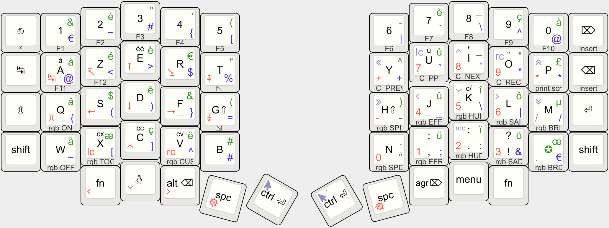

Update on October 24, 2024: Modified power supply mode to reduce power consumption. Corrected the function of automatic shutdown of RGB power supply. If your keyboard is updated before October 24th, please update the latest firmware.

If you need the 3D printed model file or if there are any abnormalities with the keyboard, please contact 380465425@qq.com

# zmk-config-sofle

this

```bash
keymap draw keymap-drawer/my-keymap.yaml > keymap-drawer/my-keymap.svg
convert -density 300 keymap-drawer/my-keymap.svg -background grey -flatten keymap-drawer/my-keymap.jpg
```

produces


or from https://www.keyboard-layout-editor.com/#/gists/f7d8eed23f6d24b042c132efe39292fd


